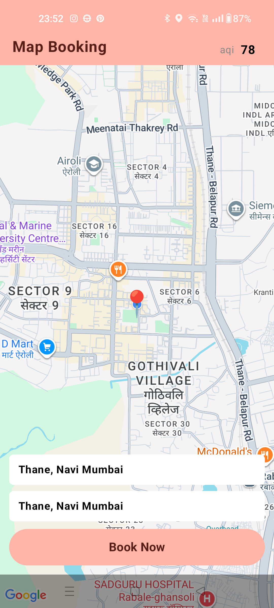
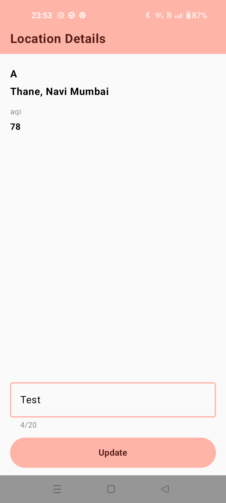
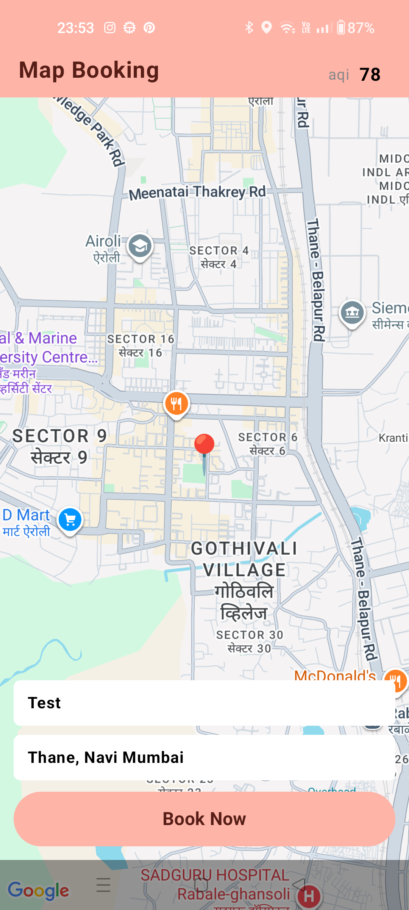
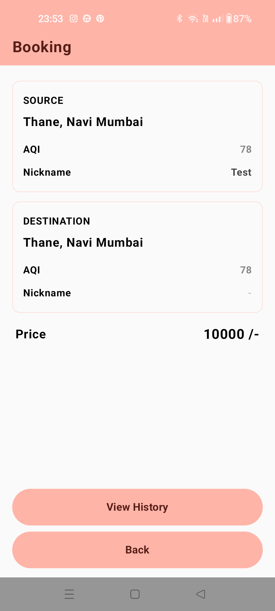
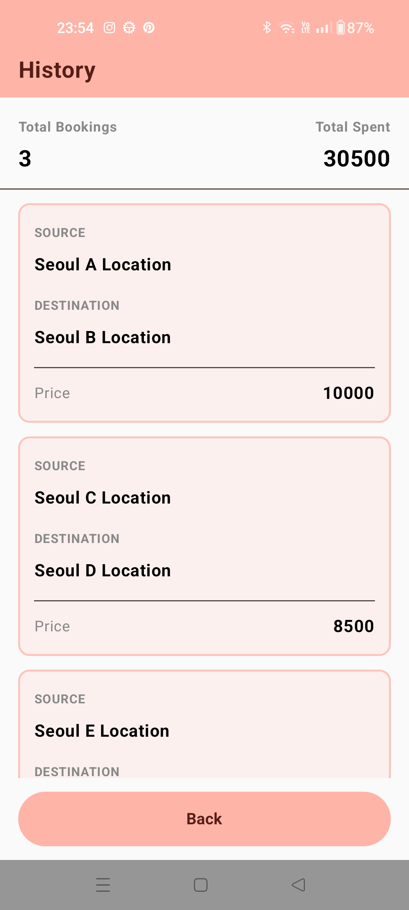

### API Keys

Before running the application, add your API keys to `local.properties`:

```properties
MAPS_API_KEY="YOUR_API_KEY"
AQI_API_KEY="YOUR_API_KEY"

```
## Screenshots

<p align="center">
  
  
  
</p>

<p align="center">
  
  
</p>